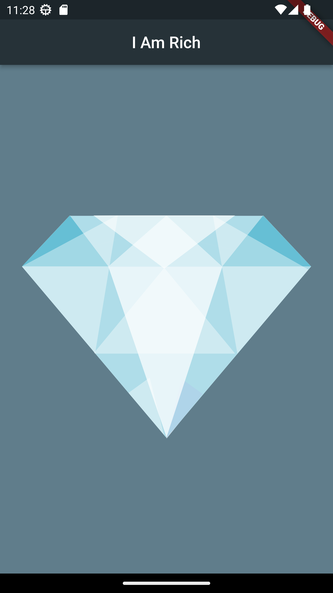

## I Am Rich App
Welcome to the luxurious world of "I Am Rich" !!

the ultimate status symbol app! This exclusive mobile application is designed to showcase your opulence and extravagant lifestyle. With its sleek design and minimalistic features, "I Am Rich" sets itself apart as a statement of affluence. Own the app that captured the world's attention back in 2008 and be part of a select few who truly understand the value of true luxury.

## Elegant Design

"I Am Rich" boasts a stunning and sophisticated design that exudes elegance. The app's user interface is carefully crafted with a focus on simplicity and refinement. Immerse yourself in a visually pleasing experience that mirrors your refined taste.

## Premium Background
The app's background color, a captivating shade of blue-grey, complements the app's overall aesthetic. It reflects the tranquility and exclusivity that only the wealthy can appreciate. Allow this color to envelop your screen and make a bold statement about your refined lifestyle.

## Prestigious App Icon
The prestigious app icon signifies the rare exclusivity of "I Am Rich." Displayed prominently on your device's home screen, this icon subtly communicates your exceptional discernment and distinguished taste to those around you.

## Limited Functionality
"I Am Rich" follows the philosophy that true luxury lies in simplicity. Embrace the freedom from complicated features and unnecessary distractions. The app offers minimal functionality, reminding users of the power of simplicity and the essence of abundance.

## Fun Fact
Originally released in 2008, "I Am Rich" gained notoriety for its audacious price tag of $999.99. Priced well above the average app at the time, it quickly became a symbol of affluence and exclusivity. Less than 24 hours after its launch, the app was pulled from the App Store due to its controversial nature.
