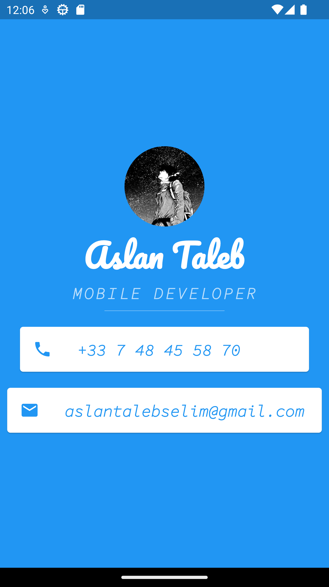

# micard

This is a Flutter application that displays personal information using various UI elements. The app showcases a profile picture, name, profession, phone number, and email address.



## Getting Started

To run this application, follow these steps:

1. Ensure you have Flutter installed on your machine. For instructions on installing Flutter, refer to the official Flutter documentation.

2. Clone the repository or download the source code files.

3. Open the project in your preferred IDE or editor.

4. Connect a device or start an emulator.

5. Run the following command in the terminal to install the required dependencies:

   ```bash
   flutter pub get

Finally, run the app using the following command:

   flutter run
   
## Application Structure : 

The main.dart file contains the entry point of the application. The MyApp class is a stateless widget that serves as the root widget for the app. It creates a MaterialApp widget, which provides a convenient way to set up the overall theme and navigation for the app.

The app consists of a single screen implemented using the Scaffold widget. The Scaffold widget provides a basic structure for the app, including an app bar and a body.

The body of the app is wrapped in a SafeArea widget to ensure that the content is displayed within the visible area of the device. The body contains a Center widget, which centers its child widget vertically and horizontally.

Inside the Center widget, there is a Column widget that arranges its children widgets in a vertical layout. The Column contains the following widgets:

CircleAvatar: Displays a circular avatar image using the provided image asset.

Text: Shows the name of the person, styled with a specific font, size, and color.

Text: Displays the profession, styled with a specific font, size, and color.

Divider: A horizontal line to separate the sections, styled with a specific color and size.

Card widgets: Display contact information in the form of phone number and email address. Each Card contains an Icon and a Text widget.

## Customization
Feel free to customize the app by making changes to the various widgets. You can modify the styling, content, and layout to suit your needs.
